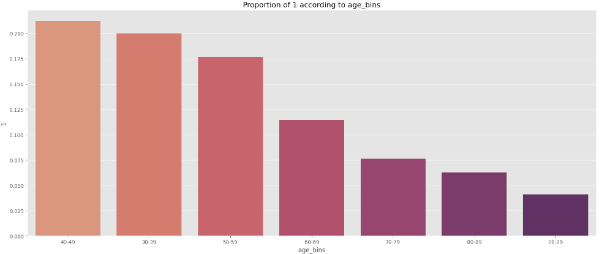
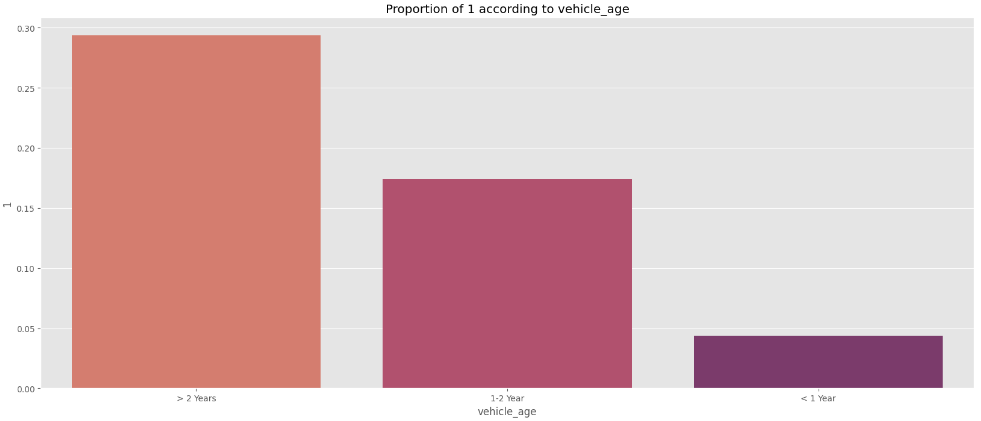
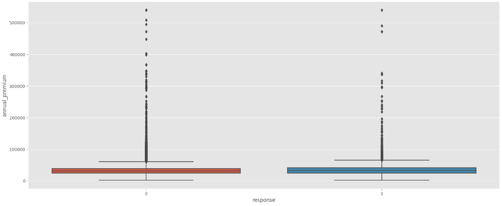

# Health Insurance Cross-Sell

## This project aims to prioritize a list of potential customers of a health insurance company that would be more interested in buying their new car insurance service

#### This project was made by Allan Casado

# 1. Business Problem.

*Disclaimer: the business problem presented below is fictcious as well as Life Safety company. The dataset was collected from Kaggle's competition [Health Insurance Cross Sell](https://www.kaggle.com/datasets/anmolkumar/health-insurance-cross-sell-prediction).*
  
Life Safety is a B2C company whose core business is offering health insurance to individuals. Now it plans to implement a cross sell strategy focused on distribuiting car insurance to its customer base. 
  
Given that the budget for the sales is limited, it is necessary to prioritize those customers who are more likely to purchase the product. Then, a Data Scientist was consulted to build **a machine learning model to order the customer base by propensity score**. 
  
To deal with this *learn to Rank* machine learning challenge, Life Safety undertook a survey with 381000 customers, and they answered whether they were interested or not in insurance car offer. The train dataset was produced with the customers attributes and theirs responses to this survey.
 
Two **data products** was developed to assist business team:
   
  1. Cumulative Gains Curve (CGC) to suport the sales operation team
  2. Google Spreadsheet for automatic predictions of the customers propensity score for a given dataset

In addition, three main questions need to be answered:

  1. What percentage of customers interested in purchasing auto insurance will the sales team be able to reach by making 20.000 calls?
  2. If the sales team's capacity increases to 40.000 calls, what percentage of customers interested in purchasing auto insurance will the sales team be able to contact?
  3. How many calls does the sales team need to make to contact 80% of customers interested in purchasing auto insurance?

# 2. Business Assumptions.

* Cross-selling: This refers to the practice of offering existing customers additional products or services. In this case, the health insurance company may be interested in cross-selling car insurance to their existing customer base.

* Lead scoring: This involves assigning a score or ranking to potential customers based on their likelihood to convert or purchase a product. By creating a propensity score for each customer, the product team can prioritize outreach to those who are most likely to be interested in the new car insurance product.

* We assume that the business team uses Google Sheets, and therefore the delivery will be made on that platform.

* The sales team has the necessary skills and capacity to make 20,000 phone calls within the campaign period.

* The customer data collected from the survey is accurate and up-to-date, and can be effectively used to segment and target potential customers.

# 3. Data Dictionary

| **Variable**         | **Description**                                                                                                             |
|----------------------|-----------------------------------------------------------------------------------------------------------------------------|
| Gender               | Gender of the customer                                                                                                      |
| Age                  | Age of the customer                                                                                                         |
| Driving_License      | 0: Customer does not have DL, 1: Customer already has DL                                                                    |
| Region_Code          | Unique code for the region of the customer                                                                                  |
| Previously_Insured   | 1: Customer already has Vehicle Insurance, 0: Customer doesn't have Vehicle Insurance                                       |
| Vehicle_Age          | Age of the Vehicle                                                                                                          |
| Vehicle_Damage       | 1: Customer got his/her vehicle damaged in the past. 0: Customer didn't get his/her vehicle damaged in the past.            |
| Annual_Premium       | The amount customer needs to pay as premium in the year                                                                     |
| Policy_Sales_Channel | Anonymized Code for the channel of outreaching to the customer ie. Different Agents, Over Mail, Over Phone, In Person, etc. |
| Vintage              | Number of Days, Customer has been associated with the company                                                               |
| Response             | 1: Customer is interested, 0: Customer is not interested                                                                    |                                                                  |

# 4. Solution Strategy

This project follows the CRISP-DM (Cross-Industry Standard Process for Data Mining) method adapted for data science processes, known as CRIS-DS. The proposed general solution is as follows:

* Study the data to find important insights for both the company and model development.
* Train a machine learning algorithm to rank potential customers based on the training dataset.
* Using the chosen algorithm, sort the test dataset to capture potential customers with the highest propensity to purchase the new insurance plan in a more accurate manner.
* Create an API for using this model and deploy it.

The detailed steps to achieve these goals are described as follows:

**Step 00. Data Collection:**
Acessed Postgress database hosted on AWS using the libraries in Python. Once connected with the database, I ran SQL queries to retrieve the necessary data from the database tables.

**Step 01. Data Description:** 
This step aims to get an dataset overview, like understanding the shape, data types, data description, missing data existence, outliers and first order descriptive statistics (min, max, mean, mode, std, quantiles, skew and kurtosis). Useful to understand the data distribuition and which deeper analysis may be undertook further.
  
**Step 02. Feature Engineering:** 
Firstly, I did a Hypothesis Mindmap on Coggle.it, where I modelled the agents that influences on the phenomena we are trying to predic (interest in vehicle insurance service) and based on it, I stated some hypothesis. I focused on 14 hypothesis and derived 3 features to help on analysis tasks and to give more inputs at feature selection. 

**Step 03. Data Filtering:**
It is essential to consider business constraints during the development process to ensure that the selected variables are not only statistically significant but also aligned with the organization's limitations. By doing so, we can increase the chances of successful deployment and adoption of the model in the real world. However, in this project, no business constraints were considered and no variable reducing was done.

**Step 04. Exploratory Data Analysis:**
Univariate, bivariate and multivariate analysis to achieve three goals: 1. Gain business experience; 2. Validate business hypotheses and generate insights and 3. Identify variables that are important for the model.

**Step 05. Data Preparation:**
Split data in train & validation dataset, and apply some scaling and encoding techniques. Scaling means putting the data in the same scale and enconding means converting categorical features to numerical features. Techniques applied: Robust Scaler, MinMax Scaler, One Hot Encoding, Frequency Encoding and Target Encoding.

**Step 06. Feature Selection:**
Feature selection is aligned with one of the principles of statistical learning, which is a theory that guarantees model learning. This is the principle of Occam's Razor, which states that the simplest explanation of an observed phenomenon should prevail over more complex explanations. More complex models do not generalize very well. They learn very well from the data they are trained on, but do not handle previously unseen data very well. To make models simpler, we need to remove collinear variables ) because they explain the same 'part' of the phenomenon being modeled. In this project, features were selected by Feature Importance gave by Random Forest Classifier.

**Step 07. Machine Learning Modelling:**
This step involves selecting an appropriate algorithm and training it with the pre-processed data. The aim is to find the best model that can generalize well on new, unseen data, and not overfit on the training set. After trained it is evaluated, using cross-validation technique, using some standard metrics for each type of ML problem. I trained three models: Random Forest, Logistic Regression and XGBoost.

**Step 08. Hyperparameter Fine Tunning:**
Choose the best parameters of the model selected at previous step. Random Search technique was used.

**Step 09. Convert Model Performance to Business Values:**
Present the business result obtained by the model.

**Step 10. Deploy Model to Production:**
I deployed the model at Render (free cloud environment) and make it acessible through a Google Spreadsheet, so it can easily improve decisions of business team.

# 5. Top 3 Data Insights

**Hypothesis 05: The customers between 20 and 30 years old shows more interest than other age groups.**  
False. The customers between 20 and 30 years old is the one that shows less interest. The group between 40 and 49 is the most interested.

**Hypothesis 07: Customers with older cars show less interest than those with newer cars.**  
False. Customers with older cars show MORE interest than those with newer cars.

**Hypothesis 03: Customers who pay a higher annual premium demonstrate less interest in car insurance.**  
False. There is no relationship between interest in car insurance and the amount paid in annual premium.

All hypotheses were validated not only with visualizations and basic metrics such as the mean, but also with hypothesis testing, using some of the most well-known tests such as the t-test, chi-squared test, and ANOVA. The use of these tests allowed for a more rigorous validation of the hypotheses, providing more confidence in the results and conclusions obtained. 

# 6. Machine Learning Model Applied

I applied three machine learning models in this project: Random Forest Logistic Regression and XGBoost Classifier. An resumed description of each one is present below:

  
Random Forest

  
Random Forest is a type of ensemble learning algorithm that creates multiple decision trees and aggregates the output to make a final prediction. Each decision tree is built using a random subset of the training data and features, which reduces the risk of overfitting and increases the accuracy of the predictions. The algorithm is effective in handling high dimensional datasets and non-linear relationships between variables.

  
Logistic Regression

  
Logistic Regression is a statistical algorithm that is used to predict a binary outcome, such as whether a customer will buy a product or not. The algorithm creates a linear regression equation that models the relationship between the dependent variable and one or more independent variables. The output of the equation is then transformed using a logistic function to produce a probability value, which is used to make the final prediction. The algorithm is simple to implement and interpret, and can handle both categorical and continuous variables.

  
XGBoost Classifier

  
XGBoost Classifier is a gradient boosting algorithm that creates a set of decision trees in a sequential manner, where each tree tries to correct the errors of the previous tree. The algorithm applies gradient descent to minimize a loss function that measures the difference between the predicted and actual values. XGBoost Classifier is known for its high accuracy and speed, and is commonly used in machine learning competitions. It also supports a variety of objective functions and can handle automaticaly with missing data and imbalanced classes.

# 7. Machine Learning Model Perfomance

# 8. Business Results

# 9. Conclusions

# 10. Lessons Learned

# 11. Next Steps to Improve
